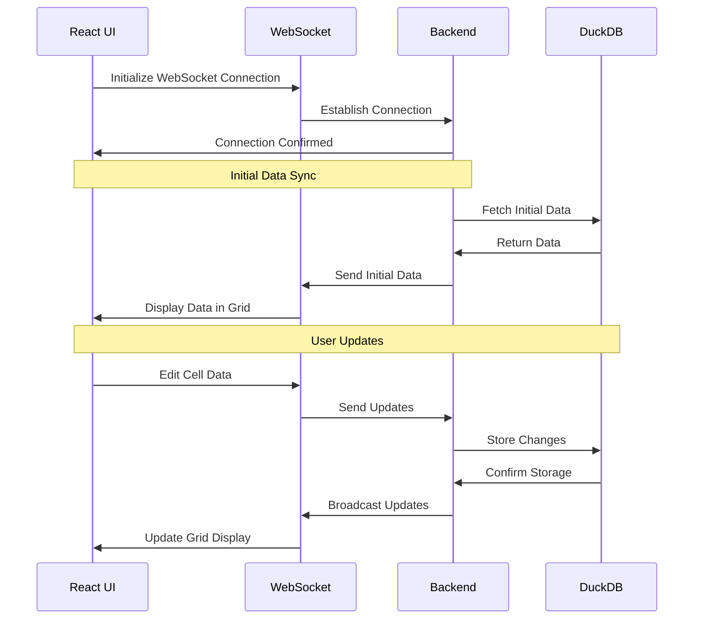
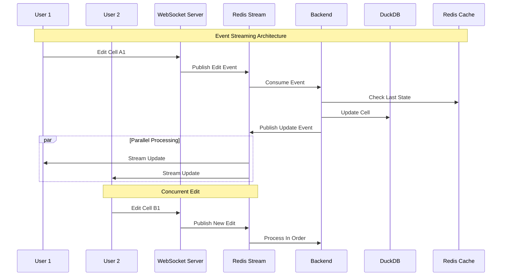

# Problem statement
In traditional spreadsheet applications, users need to install software locally and can't collaborate in real-time. We aim to create a web-based spreadsheet solution that allows users to perform basic calculations and data entry through their browser, with changes instantly syncing across all connected user via WebSocket technology and persisting in DuckDB.
# Approach

- User will see spreadsheet like interface in browser
- User can edit any cell and changes will be saved in database
- User can select multiple cells at once
- User can perform only two operations:
   - Addition of numbers
   - Multiplication of numbers


# Sequence Diagram

### Current flow

------
### Real-time Multi-User Spreadsheet with Redis Streams (Improved)



---

# Test Cases

### UI Components
#### ✅ Button Tests
- Two operation buttons in the top-right corner:
  - **Addition** (Primary variant)
  - **Multiplication** (Secondary variant)
- Visual feedback for active/inactive states

#### ✅ Grid Layout
- **10 x 6 spreadsheet grid**
- **Column headers:** A-F
- **Row headers:** 1-10

---

### Cell Operations
#### ✅ Basic Interactions
**1. Cell Editing**
- Click to activate a cell
- Edit cell content
- Press Enter to commit
- Click away to blur

**2. Cell Selection**
- Click and drag for multiple cells
- Visual selection highlight
- Selection persists until the next action

---

### Mathematical Operations
#### ✅ Addition Tests
**Test Case 1:**
1. Enter "25" in cell **A1**
2. Enter "23" in cell **B1**
3. Select both cells
4. Click **Addition**
- ✅ Expected: "48" in cell **C1**

**Test Case 2:**
1. Enter "10", "20", "30" in **A1, A2, A3**
2. Select all cells
3. Click **Addition**
- ✅ Expected: "60" in cell **A4**

#### ✅ Multiplication Tests
**Test Case 1:**
1. Enter "25" in cell **A1**
2. Enter "25" in cell **A2**
3. Select both cells
4. Click **Multiplication**
- ✅ Expected: "625" in cell **A3**

**Test Case 2:**
1. Enter "2", "3", "4" in **B1, B2, B3**
2. Select all cells
3. Click **Multiplication**
- ✅ Expected: "24" in cell **B4**

---

### Data Persistence
#### ✅ Value Persistence
- Enter multiple cell values
- Refresh the page
- Values remain unchanged

#### ✅ Operation Results
- Perform calculations
- Refresh the page
- Results persist

---


#### ✅ Edge Cases
- Large numbers
- Boundary selections
---
### Mixed Data Operations

#### ✅ Handling Mixed Data Selections

- Select multiple cells containing both numbers and letters
- Operation will be performed only on numeric values
- Text cells will be ignored in calculations
- Resulting value will be placed in the next empty cel

---

### E2E Workflow
✅ **Complete Operation Flow:**
1. Load the application
2. Enter **"10"** in **A1**
3. Enter **"20"** in **B1**
4. Select **A1, B1**
5. Click **Addition**
6. Verify **C1** shows "30"
7. Refresh the page
8. Verify persistence
9. Select **A1, C1**
10. Click **Multiplication**
11. Verify **D1** shows "300"


---
# Development

### Frontend

#### Install dependencies
```bash
npm install
```

### Run development server
```bash
npm run dev
```


---

### Backend

#### Install dependencies
```bash
npm install
```

### Create data directory for DuckDB
```bash
mkdir -p data
```

### Run development server
```bash
npm run dev
```

- ReadME first commit - feature


