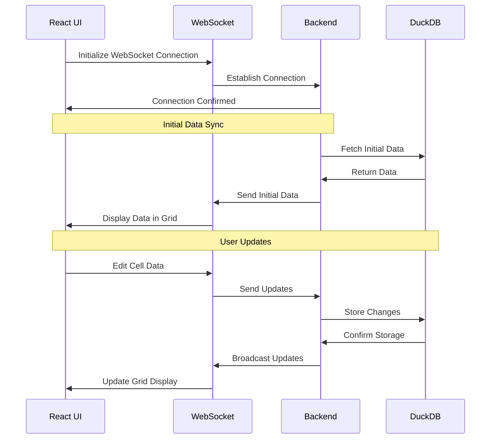

# Problem statement
In traditional spreadsheet applications, users need to install software locally and can't collaborate in real-time. We aim to create a web-based spreadsheet solution that allows users to perform basic calculations and data entry through their browser, with changes instantly syncing across all connected user via WebSocket technology and persisting in DuckDB.
# Approach

- User will see spreadsheet like interface in browser
- User can edit any cell and changes will be saved in database
- User can select multiple cells at once
- User can perform only two operations:
   - Addition of numbers
   - Multiplication of numbers

# Sequence Diagram

